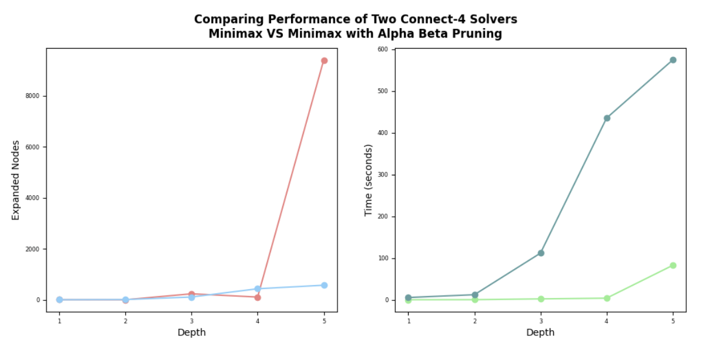
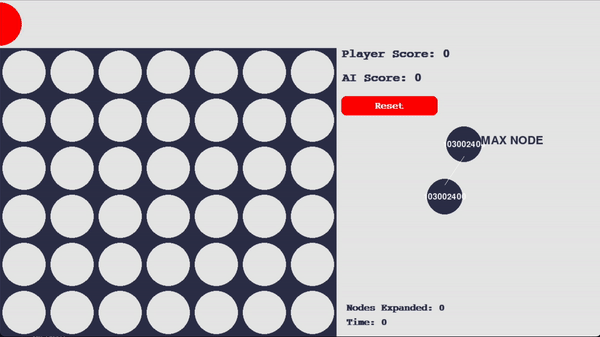

# Connect-4 AI Agent

## Introduction
Connect 4 is a zero-sum and decision-making game, a fundamental approach to solving this type of game is a game-tree search. We are going to implement the AI agent using minimax algorithm, which is a game-tree search algorithm, to tackle the game of connect 4. We are also going to show how adding alpha-beta pruning to the normal minimax algorithm can improve the efficiency of computation without chaning the value of minimax algorithm's result.

## State Representation
- The board state is represented as a 64-bit number.
- Each column takes 9 bits as follows:
-- 3 bits show the index of first empty row (000 indicate full column, while 110 indicate empty column).
-- 6 bits show the board discs (0 is for AI, 1 for human).

- An empty state would be represented as follows:
0 110000000 110000000 110000000 110000000 110000000 110000000 110000000

## Heuristic Function Evaluation
We designed a heuristic function that evaluates the state of a game and returns a number indicating whether the computer is near to win or lose and truncate the game tree after K levels evaluating the states using the heuristic function.

The evaluation function depends on the following key factors:
1. Four discs are connected horizontally, vertically or diagonally.
2. A permutation of four discs with one missing but possible-to-achieve disc horizontally, vertically or diagonally.
3. A permutation of four discs with two missing but possible-to-achieve discs horizontally, vertically or diagonally.
4. Board-independent (Blind) cell valuation based on the probability that a consecutive 4-discs will pass through.

Each factor contribute to the overall score with the following weights:
| ID | Description | Values |
|----|-------------|--------|
| 1  | Four discs are connected horizontally, vertically or diagonally. | 1,000,000 |
| 2  | A move can only be made to one of the immediately adjacent columns | 200,000 |
| 2  | A disc can be found a square away from 2 connected discs | 200,000 |
| 2  | A move can be made on either immediately adjacent columns | 10,000 |
| 3  | A permutation of four discs with two missing but possible-to-achieve discs horizontally, vertically or diagonally. | 6,000 |
| 4  | Board-independent (Blind) cell valuation based on the probability that a consecutive 4-discs will pass through. | See table below |

### Board-independent cell valuation weights:
| A  | B  | C  | D   | E   | F  | G  |
|----|----|----|-----|-----|----|----|
| 300| 400| 500| 700 | 500 | 400| 300|
| 400| 600| 800| 1000| 800 | 600| 400|
| 500| 800| 1100| 1300| 1100| 800| 500|
| 500| 800| 1100| 1300| 1100| 800| 500|
| 400| 600| 800| 1000| 800 | 600| 400|
| 300| 400| 500| 700 | 500 | 400| 300|

The evaluation function result is the difference between Human overall score and AI overall score.

### Heuristic Function Assessment
| Depth | Features     | Average Time to finish 1 game | Average Nodes Expanded per game | Wins | Loss | Ties | W/L  |
|-------|--------------|-------------------------------|---------------------------------|------|------|------|------|
| 3     | Feature 1 Only | 0.03781                      | 16.7                            | 15   | 1    | 4    | 15.0 |
| 5     |              | 0.28791                      | 165.13                          | 17   | 3    | 0    | 5.66 |
| 7     |              | 2.48418                      | 1529.9                          | 19   | 1    | 0    | 19.0 |
| 3     | Feature 2 Only | 0.25431                      | 21.18                           | 13   | 4    | 3    | 4.33 |
| 5     |              | 2.38954                      | 243.03                          | 15   | 3    | 2    | 5.0  |
| 7     |              | 16.21345                     | 2218.45                         | 16   | 3    | 1    | 5.33 |
| 3     | Feature 3 Only | 0.34491                      | 24.27                           | 11   | 4    | 5    | 2.75 |
| 5     |              | 4.54029                      | 362.0                           | 15   | 3    | 2    | 5.0  |
| 7     |              | 52.25599                     | 4356.38                         | 15   | 2    | 3    | 7.5  |
| 3     | Feature 4 Only | 0.03872                      | 26.03                           | 16   | 4    | 0    | 4.0  |
| 5     |              | 0.57498                      | 454.8                           | 17   | 3    | 0    | 5.66 |
| 7     |              | 7.43104                      | 6559.18                         | 16   | 4    | 0    | 4.0  |
| 3     | All Features | 0.97471                      | 27.91                           | 18   | 1    | 1    | 18.0 |
| 5     |              | 18.62492                     | 574.34                          | 19   | 1    | 0    | 19.0 |
| 7     |              | 270.50343                    | 9093.69                         | 19   | 1    | 0    | 19.0 |

## Minimax versus Minimax with Alpha Beta Pruning
The performance analysis demonstrates that while the Minimax algorithm provides optimal solutions, it can be computationally expensive for games with large search spaces. In contrast, the Minimax algorithm with pruning offers a significant improvement in computational efficiency by reducing the number of nodes evaluated, making it more practical for real-time applications and games with complex decision-making scenarios. The choice between the two approaches depends on the specific requirements of the application, considering factors such as time constraints, available computational resources, and the size of the search space.

## Game GUI

## Notes
- For simplicity, we performed all development and tests using a board with dimension of seven columns and six rows.
- The complete game tree for Connect Four has over 4.5 trillion different boards.
- Alpha-beta pruning does not change the value of the minimax algorithm's result; it only changes the efficiency of the computation.

## References
- [OEIS - The Online Encyclopedia for Integer Sequences](https://oeis.org/A212693)
- [Solving Connect 4 Using Artificial Intelligence (Mayank Dabas, Nishthavan Dahiya & Pratish Pushparaj)](https://link.springer.com/chapter/10.1007/978-981-16-2594-7_59)
- [Research on Different Heuristics for Minimax Algorithm Insight from Connect-4 Game (Xiyu Kang, Yiqi Wang, Yanrui Hu)](https://file.scirp.org/Html/1-9601415_90972.htm)
- [Kaggle - One-Step Lookahead](https://www.kaggle.com/code/alexisbcook/one-step-lookahead)
- [Readers' Digest - How to Win Connect 4 Every Time, According to the Computer Scientist Who Solved It](https://www.rd.com/article/how-to-win-connect-4/)